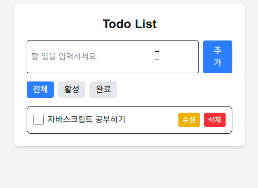
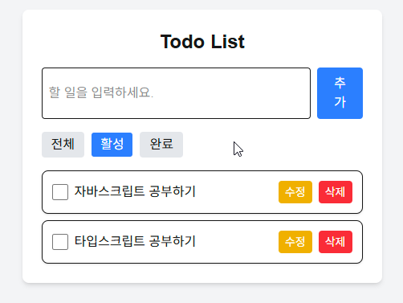
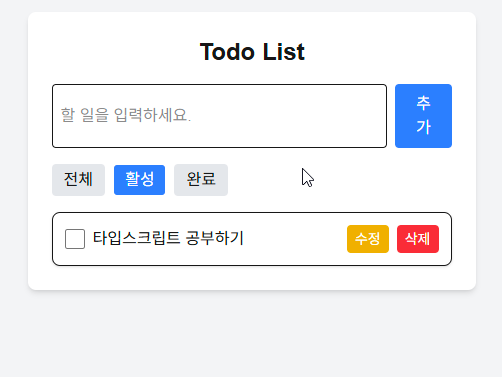
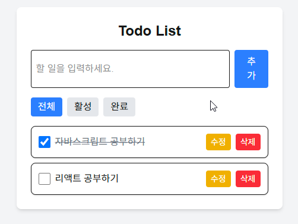
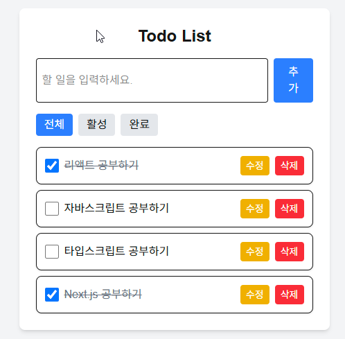

# Todo List - 프론트엔드 개발 과제

Next.js, TypeScript, TanStack Query를 사용한 할 일 관리 웹 애플리케이션입니다.

## 배포 주소

🔗 [https://todo-list-johj703s-projects.vercel.app/](https://todo-list-johj703s-projects.vercel.app/)

> **참고**
> 배포된 서비스를 사용하려면 로컬에서 json-server를 실행해야 합니다.
> 아래 '배포된 서비스 사용 시 주의 사항' 섹션을 참고해주세요.

## 주요 요구사항(기능)

- 할 일 추가, 조회, 수정, 삭제 기능(CRUD)
- 완료 상태에 따른 필터링 기능
- TanStack Query를 활용한 서버 상태 관리
- TypeScript를 사용한 타입 안정성

## 단계별 세팅 가이드

- Todo 구현

  - CRUD: 생성(Create), 조회(Read), 수정(Update), 삭제(Delete)
  - 완료된 필터링: json-server에서 필터된 데이터 가져오기
  - UI/UX: CSS 프레임워크(예: TailwindCSS) 사용, 반응형 고려

- 빌드 및 배포
  - 빌드 후 프로덕션 서버를 열어 정상 작동하는지 확인
  - Vercel 등 플랫폼에 배포

## 기술 스택

- **프론트엔드**: Next.js(App Router), React, TypeScript
- **상태 관리**: TanStack Query
- **스타일링**: Tailwind CSS
- **백엔드 목업**: json-server

## 설치 방법

1. Repository 클론

```bash
git clone https://github.com/johj703/todo-list.git
cd todo-list
```

2. 의존성 설치

```bash
yarn install
```

3. 개발 서버 실행

```bash
# 터미널 1: json-server 실행
yarn json-server

# 터미널 2: Next.js 개발 서버 실행
yarn dev
```

4. 브라우저에서 'http://localhost:3000' 접속

### 배포된 서비스 사용시 주의 사항

- Vercel에서 배포된 서비스를 사용하려면 먼저 프로젝트를 로컬에 클론하고 json-server를 실행해야 합니다.

1. 프로젝트 클론 및 디렉토리 이동

```bash
git clone https://github.com/johj703/todo-list.git
cd todo-list
```

2. 의존성 설치

```bash
yarn install
```

3. json-server 실행

```bash
yarn json-server
```

4. 이제 배포된 URL(https://todo-list-johj703.vercel.app)에 접속하여 서비스를 이용할 수 있습니다.

- 이는 개발 목적의 설정이며, 데이터는 json-server가 실행되는 로컬 환경에 저장됩니다.

## 프로젝트 구조

```
todo-list/
├── src/
│   ├── app/
│   │   ├── page.tsx         # 메인 페이지
│   │   └── layout.tsx       # 레이아웃
│   ├── components/
│   │   ├── TodoList.tsx     # 할 일 목록 컴포넌트
│   │   ├── TodoItem.tsx     # 할 일 항목 컴포넌트
│   │   ├── TodoForm.tsx     # 할 일 입력 폼
│   │   └── TodoFilter.tsx   # 필터 컴포넌트
│   ├── api/
│   │   └── todoApi.ts       # API 함수
│   ├── types/
│   │   └── todo.ts          # 타입 정의
│   └── providers/
│       └── QueryProvider.tsx # TanStack Query 프로바이더
├── db.json                  # json-server 데이터
└── package.json
```

## 사용 방법

### 1. 할 일 추가

입력 필드에 할 일을 입력하고 추가 버튼을 클릭하여 새로운 할 일을 추가합니다.



### 2. 할 일 완료 표시

체크박스를 클릭하여 할 일의 완료 상태를 토글합니다.



### 3. 할 일 수정

수정 버튼을 클릭하여 할 일의 내용을 수정합니다.



### 4. 할 일 삭제

삭제 버튼을 클릭하여 할 일을 삭제합니다.



### 5. 할 일 필터링

상단의 필터 버튼(전체, 활성, 완료)을 사용하여 할 일 목록을 필터링 합니다.



## 라이센스

```
이 README는 프로젝트의 기본적인 정보, 설치 방법, 사용 방법 등을 포함하고 있습니다. 필요에 따라 스크린샷, 데모 링크, 상세한 API 문서 등을 추가할 수 있습니다. 프로젝트의 특성에 맞게 내용을 수정하시면 됩니다.
```
